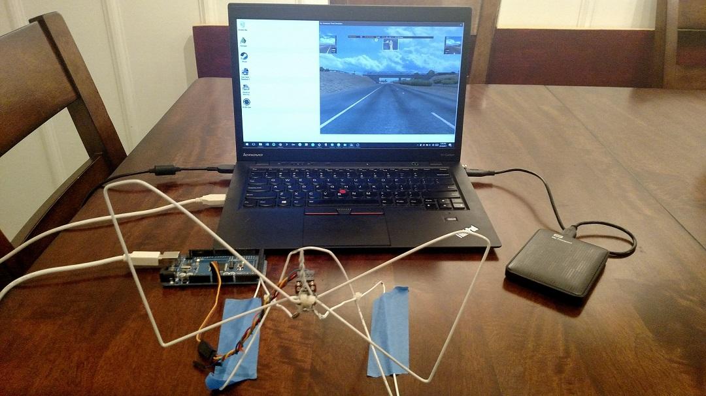
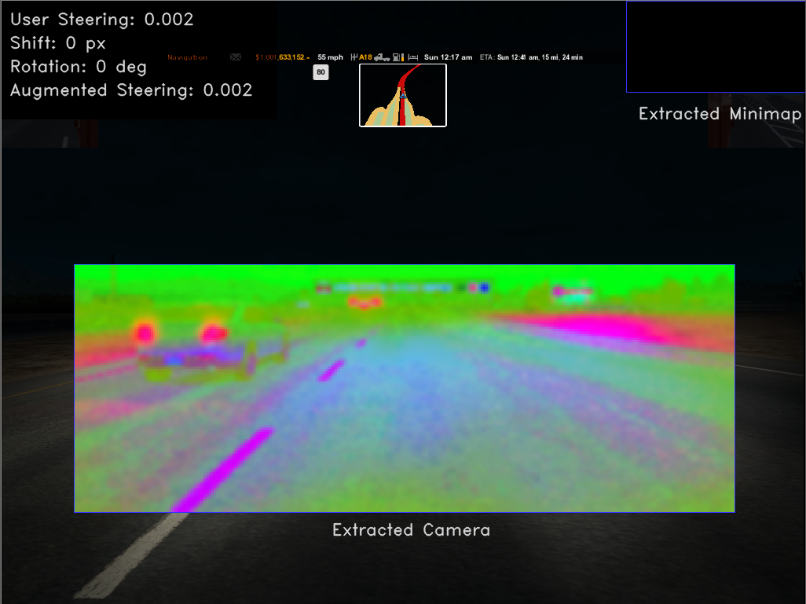
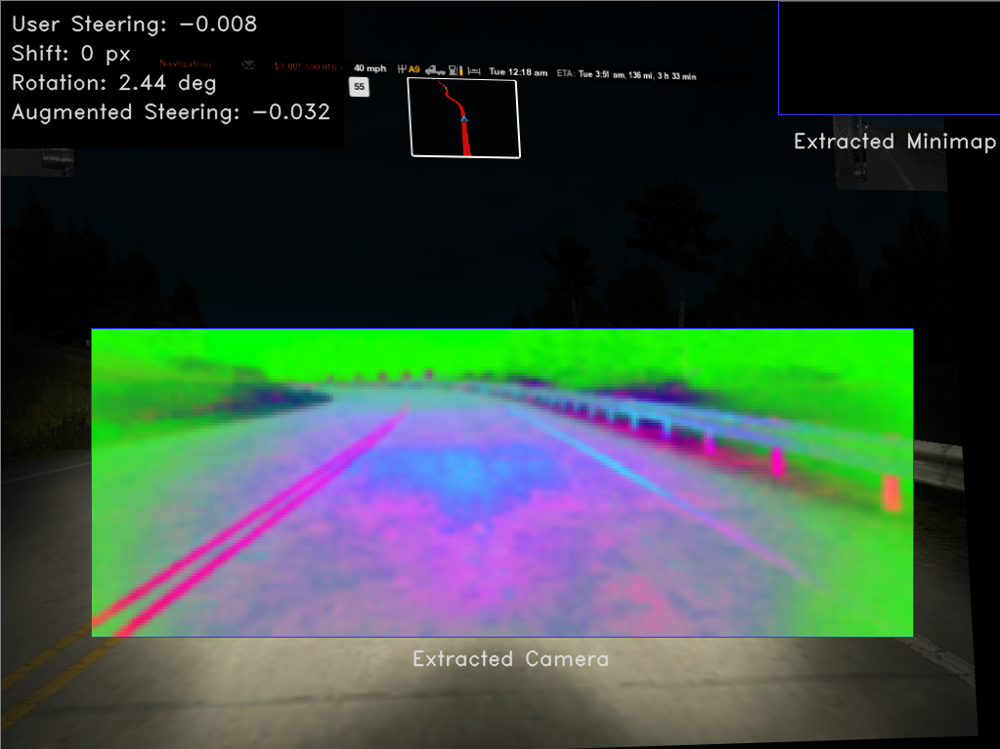
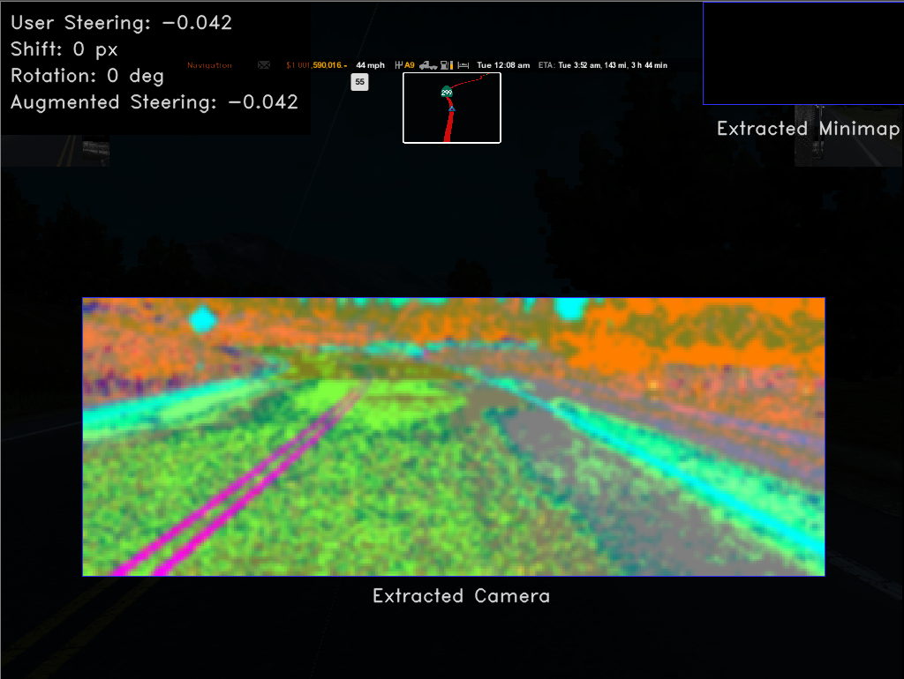

# Self Driving Truck

This project contains my experiments for creating a self driving car. I am currently
using American Truck Simulator as my test bed due to it realism, mods, and low CPU load.
It is the perfect game for testing basic self driving technology because it has a large map with
mostly highway driving and a bit of city driving.

---

## Current State:

*Sadly I had to record with my phone because my ultrabook couldn't handle the game + neural net + screen cap*

### Completed
- American Truck Simulator interface(using [capnctrl](https://github.com/djnugent/capnctrl))
- PID cruise control

### In Progress
- **Basic Behavioral Cloning** steering using single frame
  - Basic idea works but there is definitely room for improvement
- **Lane detection**
  - Not much to show
  - Want to use CV but also want to train a neural lane detector

### In Pipeline
- Prediction confidence
- LSTM
- Semantic Segmentation networks
  - Depth from mono
  - Drivable Area
- Car detector

---

## Behavioral Cloning
### Interface
I can screen cap the game window at ~15 fps. I also have access to the current speed and speed limit thanks to the ETS telemetry API. I emulate a joystick to control the game so it's easy to capture human inputs anyway I want. Currently I can control the truck's steering with a keyboard(deprecated), mouse(deprecated), or custom made steering wheel.

I can control the truck throttle using the keyboard or a PID cruise control. I usually use cruise control for an easier driving experience and for continuous throttle control(for recording).

### Recording
I currently record data using a steering wheel and cruise control for smooth control. The model can only learn as good the ground truth and using a keyboard and mouse results in jerky discrete control. I currently record the entire game window from a bumper view at **4 fps**. The bumper view is most similar to the camera height on a normal car and the 4 fps helps reduce redundant data and save memory. I label each frame with UTC timestamp, fps, steering input, throttle input, speed, speed limit, and whether cruise control is enabled or not. I record the steering angle with a delay of 300ms to account for my reaction time.

### Data input
The data goes through some preprocessing before entering the network. There are 2 inputs to the network: A cropped image of the road surface and a cropped image of the minimap.

The road surface is what I call the camera input. It is cropped to reduce nonessential data and reduce network size. The camera is converted to YUV colorspace and then each channel is normalized in order to boost contrast. This is meant to help in low light conditions. The final size of the camera image after cropping and downsampling is **(294,111,3)**

The minimap is cropped from the minimap on the top center of the screen. It thresholded for only the color of the navigation arrows in order to create a binary image of navigation cues. I don't want the network to extract lane curvature, lane heading, and possible lane positioning from the minimap(which it appeared to do in previous versions) so I only give it access to navigation cues in order to help the network resolve intersections and exits. The final size of the minimap image after cropping and downsampling is **(57,29,1)**

Below are samples to help illustrate the what the network sees:
#### Day

#### Night(headlights)

#### Night(highbeams)

#### Night(no headlights)

#### Raining

### Training
#### Uniform
For training the network I try to make sure the samples are uniform. This is super important because most of the collected data has near zero steering angles from driving straight. In order to combat this I bin the samples(at fixed increments) based on the their steering angles and then uniformly sample from the bins.

#### Augmentation
Since most of the data is collected with good "human" driving, the system doesn't know how to correct when it starts to leave the center of the lane. I have augmented with artificial lane shifting and rotation. Below are some examples of that.

**Shifting to the right**

**Rotation to the left**

### Custom loss function
Most of driving is small steering corrections for lane keeping and occasional big steering corrections for turning(not super common on highways). With a linear loss function like MSE this results in great steering behavior but lane corrections get ignored because they are small errors. In order to combat this I created a loss function that weights errors that are closer to zero. I call the loss function mean precision error. It is expressed as `MPE = mean(square(y_pred - y_true)/(abs(y_true) + gamma)` where a small gamma applies a larger weight to small values. Gamma needs to be tuned because too small a gamma with cause the network to never learn to term and become overly sensitive to noise. Currently I use a gamma of 0.1. I am still experimenting to see if MPE results in better driving performance than MSE
